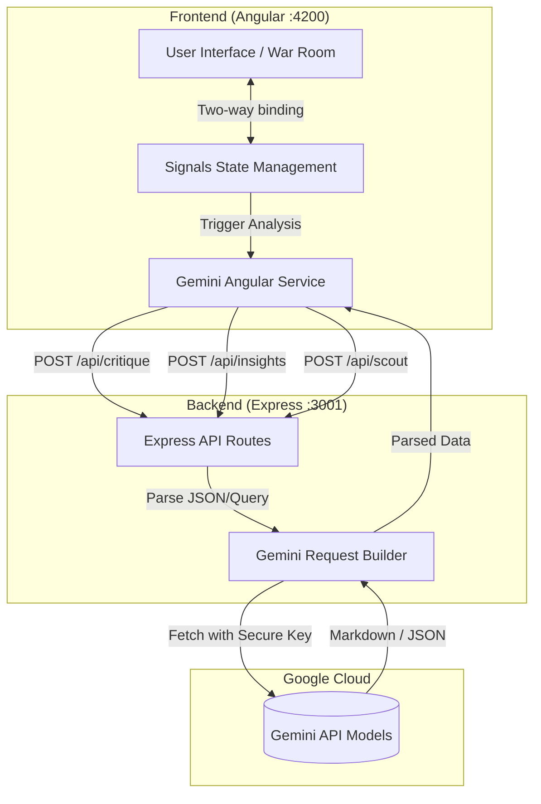

# IPL Squad Builder & War Room 🏏

An advanced, full-stack predictive squad-building and live auction simulation platform built for professional T20 cricket franchises. It features real-time budget tracking, dynamic role allocation, rival franchise tracking, and deep AI-driven strategic insights powered by **Google Gemini**.

## 🏗 Architecture & Tech Stack

The application is structured into a clean **Client-Server Architecture** to ensure security (hiding API keys) and modularity.

*   **Frontend:** Angular 17+ (Signals API, Standalone Components, Mobile-First CSS)
*   **Backend:** Node.js, Express.js, CORS
*   **AI Engine:** Google Gemini (`gemini-flash-latest`)
*   **Data Visualization:** Chart.js, `ng2-charts`

---

## 🔄 System Workflow & Diagram

The platform offloads all heavy AI requests from the browser directly to a secure Node.js proxy server. 



### Module Workflows
1.  **War Room & My Squad:** Users browse the local player database (`players.data.ts`), managing their squad within a ₹100CR limit. The Angular `Signals` API recalculates team budgets and radar charts instantaneously.
2.  **AI Insights & Critique:** When triggered, the frontend serializes the user's `[Squad Array]` and posts it to the backend. The Express server formats an elite prompt and relays it to Gemini, returning a strategic analysis that Angular renders to the UI.
3.  **AI Scouting:** Users ask natural language questions (e.g., *"Find a cheap death bowler"*). The backend evaluates the query against the current squad context and Gemini provides a specific scouting recommendation.

---

## ✨ Key Features

*   **Scouting Database:** Filterable list of all available players.
*   **Dynamic Pitch UI:** Drag-and-drop or click-to-add players into an 11-man formation.
*   **Rival Tracker:** Watch live simulations of other franchises bidding on players.
*   **Simulation Engine:** Generates an animated, typewriter-style log of bidding wars for your current squad.
*   **AI Coach Critique:** Instant 3-sentence evaluation of your team balance.
*   **Deep Strategy Report:** In-depth Markdown-rendered evaluation of strengths, vulnerabilities, and star players.
*   **Lock & Export:** Lock the squad to generate a shareable URL and download the raw JSON payload.

---

## 🚀 Setup & Execution

You must run both the backend and frontend simultaneously.

### 1. Start the Backend
The backend runs on port 3001 and securely holds the Gemini API Key.
```bash
cd squad-builder/server
npm install
node index.js
```
*Health Check:* Open `http://localhost:3001/api/health`

### 2. Start the Frontend
The frontend runs on port 4200.
```bash
cd squad-builder
npm install
npm run start
```
*Access the App:* Open `http://localhost:4200`

---

## 📂 Project Structure

```text
squad-builder/
├── src/                          ← FRONTEND (Angular)
│   ├── app/
│   │   ├── app.ts                ← Main logic, state management (Signals)
│   │   ├── app.html              ← UI Templates & Modals
│   │   ├── app.css               ← Responsive Styling & Breakpoints
│   │   ├── gemini.service.ts     ← HTTP Client communicating with backend
│   │   └── players.data.ts       ← Mock database of players
│   └── styles.css
│
└── server/                       ← BACKEND (Express.js)
    ├── index.js                  ← API routing & Gemini proxy logic
    └── package.json              ← Backend dependencies
```
